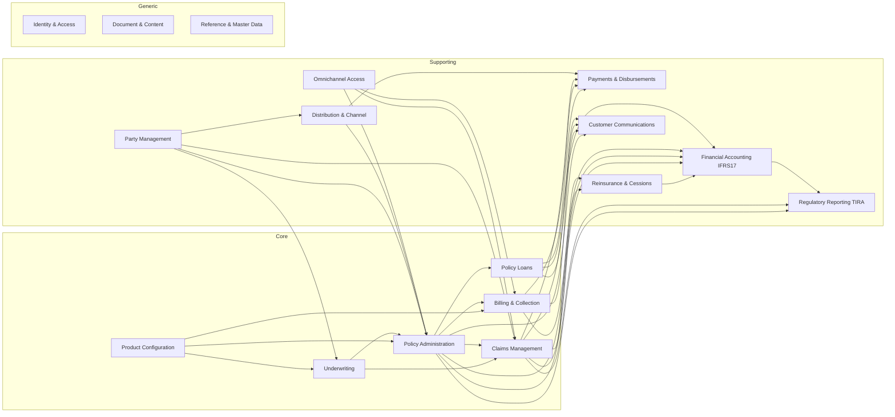

# Deliverable 1 — Domain Map & Bounded Contexts
**Digital Life Insurance Core Platform — Tanzania (Phase 0, Artifact 1 of 8)**

> Method note: produced from DDD strategic-design practice applied to your stated capability list, plus trained knowledge of TIRA's regulatory posture, IFRS 17 for insurers, Tanzania's mobile-money ecosystem, and the openIMIS/Fineract domain patterns you referenced for modeling inspiration only. Live web search was unavailable this session (proxy rejected the request) — items below that depend on current regulatory specifics are flagged **[VERIFY]** rather than asserted as fact. Nothing here is final; it's the basis for your review before we touch Deliverable 2.

---

## 1. Subdomain Classification

DDD distinguishes *why* a subdomain exists — this determines how much architectural investment it deserves and which ones you should never outsource.

| Class | Meaning | Subdomains |
|---|---|---|
| **Core** | Where the business wins or loses competitively; deserves your best design effort and must never be a generic off-the-shelf fit | Product Configuration, Underwriting & Risk Assessment, Policy Administration, Policy Loans & Cash Value, Premium Billing & Collection, Claims Management |
| **Supporting** | Specific to this business but not differentiating; solid design needed, but simpler patterns are acceptable | Party Management, Distribution & Channel Management, Payments & Disbursements, Reinsurance & Cessions, Financial Accounting (IFRS 17), Regulatory Reporting (TIRA), Customer Communications, Omnichannel Access |
| **Generic** | Solved problems; buy/adopt, don't reinvent | Identity & Access Management, Document & Content Management, Reference & Master Data |

This gives 17 bounded contexts total. That's a large but not unreasonable number for a full core insurance administration system — Deliverable 2 will map these to Spring Modulith modules, and some generic contexts may end up as thin wrapper modules around off-the-shelf infrastructure (Keycloak, MinIO) rather than hand-built domain logic.

**Open decision for your sign-off:** the capability list uses "Client & Agent Registration." I've split this into a DDD **Party** abstraction (core identity shared by individuals, corporates, agents, brokers) plus a separate **Distribution & Channel Management** context (the business role of being a sales/service channel member — licensing, hierarchy, commissions). This is a naming generalization, which your own AI Coding Rules flag as something requiring explicit approval — see Open Questions §6.

---

## 2. Bounded Context Catalog

### CORE

**2.1 Product Configuration**
- Responsibility: defines insurable products (term life, endowment, whole life, annuity, unit-linked, group life/education savings) as configurable templates — benefit structures, premium rating factors, mortality/morbidity tables, surrender/loan rules, fund definitions for unit-linked. This is configuration data, not code — a new product variant must not require a deployment.
- Key aggregates: `ProductDefinition`, `RatingTable`, `BenefitSchedule`, `FundDefinition` (unit-linked)
- Relationships: upstream of Underwriting, Policy Administration, Premium Billing. Acts as **Open Host Service** — other contexts consume its published `ProductSnapshot` rather than reading live config, so a mid-term product-rule change doesn't retroactively mutate in-force policies.

**2.2 Underwriting & Risk Assessment**
- Responsibility: assesses proposed risks (medical, financial, occupational) against product rules and issues an accept/rate-up/decline/postpone decision. Also revisited for claims contestability (e.g., non-disclosure within the 2-year contestability window — standard in most African life markets; **[VERIFY]** exact period under Tanzanian law/TIRA guidance).
- Key aggregates: `UnderwritingCase`, `RiskAssessment`, `MedicalDisclosure`
- Relationships: downstream of Party (applicant data) and Product (rating rules); upstream of Policy Administration (decision gates issuance) and Claims (contestability lookups). Rules evaluated via Drools — Underwriting owns the rule *outcomes*, not the engine itself.

**2.3 Policy Administration**
- Responsibility: the system of record for the insurance contract across its full lifecycle — issuance, endorsement, renewal, reinstatement, surrender, maturity. Owns the contract's cash/account value ledger (needed for savings, endowment, unit-linked, annuity products) since loan eligibility and surrender value both derive from it.
- Key aggregates: `Policy` (aggregate root), `PolicyAccount` (cash/fund value ledger), `Endorsement`, `Beneficiary`
- Relationships: the hub of the platform — downstream of Underwriting (issuance decision) and Product (terms); upstream of Billing (drives premium schedule), Claims (coverage validation), Policy Loans (collateral value), Reinsurance (cession trigger), Financial Accounting (contract events). **Customer/Supplier** with most other core contexts, meaning Policy Administration's team has significant say over the contracts other teams build against.

**2.4 Policy Loans & Cash Value**
- Responsibility: loans collateralized by a policy's surrender/cash value — origination, interest accrual, repayment, and forced-lapse-on-shortfall handling. Modeled as its own context (Fineract-style loan servicing pattern) rather than folded into Policy Administration, because loan servicing has its own lifecycle/state machine and this keeps Policy Administration's aggregate from becoming a "God object."
- Key aggregates: `PolicyLoan`, `RepaymentSchedule`
- Relationships: downstream of Policy Administration (reads available loan value via its public API, never its tables directly), downstream of Payments (disbursement/repayment execution), upstream of Financial Accounting.

**2.5 Premium Billing & Collection**
- Responsibility: generates premium due schedules from policy terms, tracks arrears/grace periods, applies lapse rules, issues dunning/reminders. Distinct from *Payments* — this context decides "what is owed, by when, and what happens if unpaid"; it never touches a payment rail directly.
- Key aggregates: `BillingSchedule`, `PremiumInvoice`, `ArrearsCase`
- Relationships: downstream of Policy Administration (schedule inputs) and Product (grace period/lapse rules); upstream of Payments (issues `PaymentRequest`) and Financial Accounting.

**2.6 Claims Management**
- Responsibility: intake, adjudication, and settlement authorization for death, disability, critical illness, and maturity claims. Maturity claims are largely systematic (policy reaches term) vs. death/disability/CI which require evidence review and possibly Underwriting's contestability input.
- Key aggregates: `Claim`, `ClaimAssessment`, `SettlementDecision`
- Relationships: downstream of Policy Administration (coverage verification), Underwriting (contestability), Reinsurance (recovery calculation); upstream of Payments (payout), Reinsurance (recovery notification), Financial Accounting (claims reserve/expense).

### SUPPORTING

**2.7 Party Management**
- Responsibility: core identity and KYC status for every human/organization the platform knows about — individual, corporate, group/SACCO, and the underlying identity of agents/brokers (their business-role attributes live in Distribution). Single source of truth preventing duplicate-customer problems across channels.
- Key aggregates: `Party` (root), `Individual`, `Corporate`, `Group`, `KycRecord`
- Relationships: upstream of nearly everything (Policy, Underwriting, Claims, Distribution, Billing all reference `PartyId`). **Open Host Service** — exposes a stable `PartyDTO` (published language) so downstream contexts never need Party's internal schema.

**2.8 Distribution & Channel Management**
- Responsibility: the business of being a sales/service channel — agent/broker licensing and status (tie to TIRA agent licensing **[VERIFY]** current licensing categories), agency hierarchy, bancassurance partner agreements, commission plans and calculation.
- Key aggregates: `Agent`/`Broker` (references `PartyId`), `AgencyHierarchy`, `CommissionPlan`, `CommissionStatement`
- Relationships: downstream of Party (identity) and Product (commission eligibility rules); upstream of Policy Administration (agent-of-record on a policy) and Payments (commission payout instructions).

**2.9 Payments & Disbursements**
- Responsibility: the *only* context that talks to external money-movement rails — mobile money aggregator (M-Pesa, Airtel Money, Tigo Pesa/Mixx by Yas **[VERIFY current brand name]**), bank transfer, cash. Handles both collections (inbound) and disbursements (outbound: claims, maturities, surrenders, loan proceeds, commissions, reinsurance settlements). This is a textbook **Anti-Corruption Layer** — external gateway callback formats never leak into the domain; everything is translated to `PaymentConfirmed`/`PaymentFailed`/`DisbursementCompleted`.
- Key aggregates: `PaymentTransaction`, `DisbursementInstruction`, `PayoutBatch`
- Relationships: downstream of Billing, Claims, Policy Loans, Distribution (all raise payment/disbursement requests); the external mobile money/bank APIs are further downstream still, wrapped behind this context's ports.

**2.10 Reinsurance & Cessions**
- Responsibility: treaty definitions (quota share, surplus, excess-of-loss), automatic cession calculation on new business bound to treaty terms, and claim recovery processing.
- Key aggregates: `ReinsuranceTreaty`, `Cession`, `ClaimRecovery`
- Relationships: downstream of Policy Administration (cession trigger on issuance) and Claims (recovery trigger); upstream of Financial Accounting (ceded premium/claims entries).

**2.11 Financial Accounting (IFRS 17)**
- Responsibility: builds and maintains the IFRS 17 measurement model — grouping contracts into cohorts, Liability for Remaining Coverage / Liability for Incurred Claims, Contractual Service Margin roll-forward, risk adjustment. This context does **not** re-derive business facts; it consumes domain events from Policy, Billing, Claims, Reinsurance, and Policy Loans as its inputs (event-carried state transfer) and applies actuarial/accounting transformation. **[VERIFY]** whether short-duration group products (e.g., annual renewable group life) should use the Premium Allocation Approach vs. General Measurement Model — this is an actuarial/audit decision, not an architecture one, and materially changes this context's aggregate shape. Flagging for your actuarial team before Deliverable 3.
- Key aggregates: `GroupOfInsuranceContracts`, `CsmRollForward`, `LrcLedger`, `LicLedger`
- Relationships: downstream of essentially all core/supporting transactional contexts; a pure consumer, never a source of business truth.

**2.12 Regulatory Reporting (TIRA)**
- Responsibility: produces TIRA's required prudential/statistical returns and supports the Regulator Read-Only Portal. **[VERIFY]** current TIRA return schedule/format — I'm assuming quarterly and annual prudential returns plus ad hoc statistical requests, consistent with typical East African insurance regulatory regimes, but the specific forms should come from a current TIRA circular, not from me.
- Key aggregates: none of its own in the transactional sense — this is a **read-model / reporting context** (CQRS-style), built from events published by Policy, Claims, Billing, Financial Accounting, Party, Distribution.
- Relationships: downstream of nearly everything; exposes the Regulator Read-Only Portal.

**2.13 Customer Communications**
- Responsibility: outbound multi-channel messaging (SMS, push, email, USSD prompts) triggered by domain events — premium due, claim decision, policy issued, loan disbursed — in Swahili for customer-facing content, English for back-office. Template management, delivery tracking, opt-in/consent.
- Key aggregates: `NotificationTemplate`, `NotificationDispatch`
- Relationships: pure downstream consumer of domain events from every other context; publishes nothing back except delivery-status events.

**2.14 Omnichannel Access (Channel Gateway)**
- Responsibility: translates channel-specific interaction models — USSD session state machine (`*150*01#`-style menus, Redis-backed session state given intermittent connectivity), SMS free-text command parsing, and portal BFFs — into standard core-API calls. This is the **Anti-Corruption Layer / Conformist adapter** on the inbound side, mirroring Payments' role on the money-movement side.
- Key aggregates: `UssdSession`, `SmsCommand` (these are technical/session state, not business aggregates)
- Relationships: pure inbound adapter — calls into Policy Administration, Billing, Claims public APIs; owns no core business state.
- Note: offline agent data capture (poor rural connectivity) is a cross-cutting concern — likely an offline-first client with eventual sync/conflict-resolution against Party/Policy/Underwriting APIs. Flagging for Deliverable 7 (Infrastructure) rather than solving here.

### GENERIC

**2.15 Identity & Access Management**
- Responsibility: authentication and coarse-grained authorization across the three Keycloak realms (customers, agents, staff), tenant-context issuance in JWT claims. Deliberately thin — Keycloak does the heavy lifting; this "context" is really the integration contract (claims schema: `tenant_id`, `party_id`, `roles`) that every module trusts.
- Key aggregates: none (delegated to Keycloak); this context owns the **claims contract**, not user records.

**2.16 Document & Content Management**
- Responsibility: KYC documents, policy documents, claim evidence, signed forms — stored in MinIO, referenced by URI from other contexts' aggregates. Generic capability, exposed as a simple port (`DocumentStorePort`) other contexts inject.
- Key aggregates: `DocumentRecord` (metadata only; binary lives in MinIO).

**2.17 Reference & Master Data**
- Responsibility: **tenant-global** lookup data — country/currency codes, occupation classification, TIRA product/return codes. Explicitly *not* tenant-scoped (per your multi-tenancy rules), read-heavy, rarely written.
- Key aggregates: `ReferenceCodeSet` (generic key-value/code-list structure, not a rich domain model).

---

## 3. Context Map

**Legend for relationship patterns (standard DDD context-mapping vocabulary):**
`OHS/PL` = Open Host Service + Published Language · `ACL` = Anti-Corruption Layer · `CS` = Customer/Supplier · `P` = Partnership · `SK` = Shared Kernel · `ECST` = Event-Carried State Transfer

| Upstream | Downstream | Pattern | Integration mechanism |
|---|---|---|---|
| Party Management | Policy Admin, Underwriting, Claims, Distribution, Billing | OHS/PL | Sync API (`PartyDTO`) |
| Product Configuration | Underwriting, Policy Admin, Billing, Distribution | OHS/PL | Sync API (`ProductSnapshot`, versioned) |
| Underwriting | Policy Admin | CS | Sync API + `UnderwritingDecisionMade` event |
| Underwriting | Claims | CS | Sync API (contestability lookup) |
| Policy Administration | Billing, Claims, Policy Loans, Reinsurance, Financial Accounting | CS + ECST | `PolicyIssued`, `PolicyEndorsed`, `PolicyLapsed`, `PolicyMatured` events + sync read APIs |
| Policy Loans | Payments | CS | `LoanDisbursementRequested` command/event |
| Billing | Payments | CS | `PaymentRequested` event; consumes `PaymentConfirmed` |
| Claims | Payments, Reinsurance | CS | `PayoutRequested`, `RecoveryTriggered` events |
| Reinsurance | Financial Accounting | ECST | `CessionRecorded`, `RecoveryConfirmed` events |
| All core/supporting contexts | Financial Accounting (IFRS17) | ECST | Domain events → accounting translation layer (pure consumer) |
| All contexts | Regulatory Reporting (TIRA) | ECST | Domain events → reporting read models (pure consumer) |
| All contexts | Customer Communications | ECST | Domain events → notification dispatch (pure consumer) |
| Omnichannel Access | Policy Admin, Billing, Claims, Party | ACL/Conformist | Sync API calls only, inbound direction |
| Payments | External mobile money/bank gateways | ACL | Gateway-specific adapters behind `PaymentGatewayPort` |
| Identity & Access | All modules | Conformist | JWT claims contract (`tenant_id`, `party_id`, `roles`) |
| Document & Content Mgmt | Party, Underwriting, Claims, Policy Admin | OHS | `DocumentStorePort` |
| Reference & Master Data | All modules | OHS | Read-only sync API, cached aggressively (Redis) |

---

## 4. Shared Kernel

A small, deliberately minimal set of value objects shared across module public APIs (versioned as a library, changes require cross-team agreement — the riskiest relationship type in DDD, kept intentionally tiny):

`TenantId`, `PartyId`, `PolicyNumber`, `Money` (currency + amount — TZS primary, multi-currency-capable for future markets), `DateRange`, `Address`, `AuditMetadata` (created/modified by, timestamps — needed everywhere for TIRA audit trail requirements).

---

## 5. Ubiquitous Language Glossary (per context, key terms only)

**Party Management** — *Party*: any individual/organization known to the platform. *KYC Status*: verified/pending/rejected. *Group*: a SACCO/employer enrolling members under one master arrangement.

**Product Configuration** — *Product Definition*: a versioned, configurable template. *Rating Factor*: input to premium calculation (age, sum assured, occupation class, smoker status). *Fund*: a unit-linked investment pool with its own NAV.

**Underwriting** — *Underwriting Case*: one risk-assessment instance tied to an application. *Loading*: a premium surcharge for elevated risk. *Contestability Period*: window during which non-disclosure can void a claim.

**Policy Administration** — *Policy*: the contract aggregate. *Endorsement*: a mid-term contract amendment. *Cash Value*: accumulated savings/surrender value on a policy. *Lapse*: coverage suspension for non-payment. *Reinstatement*: restoring a lapsed policy.

**Policy Loans** — *Loanable Value*: the maximum a policy can be borrowed against. *Forced Lapse*: automatic policy termination when loan balance plus interest exceeds cash value.

**Premium Billing & Collection** — *Billing Schedule*: the due-date/amount sequence for a policy. *Grace Period*: time allowed post-due-date before lapse. *Arrears*: unpaid premium balance.

**Claims Management** — *Claim*: a request for benefit payment. *Adjudication*: the assessment/decision process. *Settlement*: the approved payout instruction.

**Distribution & Channel Management** — *Agent of Record*: the agent credited with a policy. *Commission Plan*: the rule set determining agent/broker earnings. *Bancassurance Partner*: a bank distributing insurance under partnership.

**Payments & Disbursements** — *Payment Transaction*: an inbound collection. *Disbursement*: an outbound payout. *Payout Batch*: a grouped set of disbursements (e.g., bulk commission run).

**Reinsurance & Cessions** — *Treaty*: the standing reinsurance agreement. *Cession*: the portion of a specific risk ceded to a reinsurer. *Recovery*: reinsurer's share of a paid claim.

**Financial Accounting (IFRS 17)** — *Group of Insurance Contracts*: the IFRS 17 unit of account. *CSM (Contractual Service Margin)*: unearned profit recognized over the coverage period. *LRC/LIC*: Liability for Remaining Coverage / Liability for Incurred Claims.

**Regulatory Reporting (TIRA)** — *Prudential Return*: periodic solvency/financial submission to TIRA. *Statistical Return*: operational/business-mix submission.

**Customer Communications** — *Notification Template*: a parameterized message definition per channel/language. *Dispatch*: one send attempt with delivery status.

**Omnichannel Access** — *USSD Session*: a stateful, short-lived menu interaction. *Channel Command*: a parsed, channel-neutral instruction sent to a core context.

---

## 6. Open Questions Requiring Your Sign-Off Before Deliverable 2

1. **"Party" abstraction** — confirm the Client/Agent generalization into a shared `Party` concept (with Distribution owning the agent-specific business role) is acceptable, per your no-silent-rename rule.
2. **Billing vs. Payments split** — confirm you want "what's owed" (Billing) architecturally separated from "how money moves" (Payments), rather than one combined module.
3. **Policy Loans as a standalone context** vs. a sub-component of Policy Administration — I've recommended standalone (Fineract-style loan servicing), but this is a real trade-off worth your explicit call.
4. **IFRS 17 measurement approach per product line** (GMM vs. PAA) — needs your actuarial team's input; materially affects Financial Accounting's aggregate design in Deliverable 3.
5. **TIRA return formats/current schedule** — please share the current TIRA circular(s) or confirm I should proceed on generic East African prudential/statistical return assumptions, clearly marked as placeholders.
6. **Contestability period length** and any other statutory time limits (grace period minimums, surrender value floor, etc.) specific to Tanzanian life insurance law.
7. **Offline agent capability** — acknowledged as a cross-cutting concern for Deliverable 7; flag now if it should instead influence bounded-context boundaries (e.g., a dedicated offline-sync context) rather than being purely an infrastructure pattern.

---

*End of Deliverable 1. Per your process, I'm stopping here for review. Once you confirm or amend the bounded contexts, naming, and open questions above, I'll proceed to Deliverable 2 (Module Architecture: mapping these contexts to Spring Modulith modules, public APIs, event contracts, and data ownership).*
