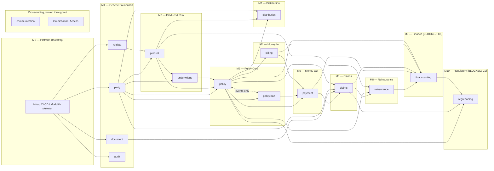

# Deliverable 8 — Implementation Roadmap
**Digital Life Insurance Core Platform — Tanzania (Phase 0, Artifact 8 of 8 — Final)**

---

## 1. What This Is and Isn't

This is a **build-sequencing plan**, not a project plan. It has no dates, no story points, and no staffing assumptions — I have none of that input, and inventing it would violate "never invent business rules" in spirit even though it's not strictly a business rule. What it does provide is an answer to the question every one of the prior seven deliverables has been implicitly building toward: **in what order can the 18 modules actually be built, given the dependency graph, aggregate designs, event contracts, and schemas already agreed?**

The ordering logic has one deliberate design property worth stating up front: **modules whose design still depends on an open item are scheduled last**, not first. This isn't just caution — it means resolving those open items late doesn't force rework of anything already built. Where that applies to a milestone, I've said so explicitly rather than let it hide in a dependency arrow.

---

## 2. Build-Order Principles

Four inputs drive the sequencing, all already established in prior deliverables:

1. **Synchronous dependency DAG** (Deliverable 2 Rev 2) — a module that calls another module's public API synchronously must be built no earlier than its dependency. Event-only relationships (e.g. `policy` ↔ `policyloan` for surrender/maturity netting) don't force an order — they force both sides to exist before the choreography can be *tested*, but not before either can be *started*.
2. **Subdomain classification** (Deliverable 1) — Core subdomains earn the platform's differentiation and carry the highest schedule risk if delayed; Generic subdomains are commodity plumbing best built early and stayed out of everyone else's way.
3. **Aggregate/schema stability** (Deliverables 3 and 6) — modules whose aggregate design is fully resolved (no outstanding 🔴/🟡 items) can start immediately; modules with an unresolved external dependency (C1 IFRS17, C2 TIRA) are scheduled behind everything that doesn't need them.
4. **Blast radius of rework** — `party`, `refdata`, and `audit` are consumed by nearly every other module (party via `PartyRef`, refdata via lookup codes, audit via the generic event listener). Any schema change to these late in the build ripples everywhere, so they're deliberately front-loaded even though, strictly, nothing forces `refdata` to be module #1.

---

## 3. Module Dependency Graph (Build Sequencing View)

This is **not** the same diagram as Deliverable 2's runtime call graph — it collapses event-only relationships into "must exist before the choreography is testable" rather than "must exist before the other can compile," and it adds `audit` as a universal listener with no forward edges of its own.

---

## 4. Phased Build Plan

### M0 — Platform Bootstrap
**Scope:** Repository skeleton with all 18 module packages stubbed (empty `domain/application/infrastructure/api` per Deliverable 2's convention), `docker-compose.yml` + observability overlay running, CI/CD pipeline green on a trivial commit, Keycloak realms imported, empty Flyway migration chain applying cleanly.
**Depends on:** Nothing — this is Deliverable 7 made real.
**Acceptance criteria:** `ApplicationModules.of(Application.class).verify()` passes against 18 empty modules; `docker compose up` succeeds; CI's nine jobs all go green on a no-op commit; `db-migration-validation`'s `app_role` privilege assertion passes.
**Open items in play:** None block this milestone.

### M1 — Generic Foundation: `refdata`, `party`, `document`, `audit`
**Scope:** Reference data seed loading (with the four placeholder parameters clearly flagged as non-production in code comments, not just the migration file); the `Party`/`Client`/`Agent`/`Group`/`GroupMembership` aggregates and public API; MinIO-backed document storage port; the generic `DomainEventEnvelope<?>` audit listener and WORM `audit_log` writer.
**Depends on:** M0 only. These four have no dependency on any other business module.
**Acceptance criteria:** `party`'s API is contract-tested against `openapi-party.yaml`; the Deliverable 6 RLS smoke test (insert as two tenants, query as `app_role` with `SET ROLE`, confirm exactly one tenant's rows visible) is captured as an automated integration test, not a one-time manual check; `audit_log` receives a row for a synthetic test event end-to-end.
**Open items in play:** None block start. `audit_log` retention (open item 3) doesn't block *building* the writer — only the eventual retention policy configuration, which is a `pg_partman` config change, not a code change.

### M2 — Product & Risk: `product`, `underwriting`
**Scope:** Product configuration (plans, riders, rating tables) and the underwriting decision workflow (`RulesEnginePort`/Drools).
**Depends on:** M1 (`refdata` for lookup codes, `party` for applicant data).
**Acceptance criteria:** Underwriting decision test suite covers the rule scenarios documented in Deliverable 3; product configuration API contract-validated.
**Open items in play:** None.

### M3 — Policy Core: `policy`, `policyloan`
**Scope:** The two most tightly-coupled core modules, built together deliberately rather than sequentially — `policyloan`'s synchronous call into `policy` (`reserveLoanValue`/`confirmReservation`/`releaseReservation`) and the event-driven surrender/maturity netting choreography both need both sides present to test meaningfully.
**Depends on:** M2 (`product`, `underwriting`), M1 (`party`).
**Acceptance criteria:** Full policy lifecycle state machine (Active → Suspended → Lapsed → Reinstated/Surrendered, per Deliverable 3 Rev 2's explicit state machine) under test; loan reserve/confirm/release integration test covering the race condition B1 fix; the surrender/maturity Camunda process instance runs end-to-end in a test environment including the timeout/compensation paths from Deliverable 3 Rev 2 §12.
**Open items in play:** **This is where open item 1 (Camunda 7 embedded vs. Camunda 8/Zeebe) becomes hard-blocking**, not just an infrastructure preference — the process definition, deployment mechanism, and compensation-handler wiring are materially different between the two. This milestone should not start its Camunda-dependent work until that's confirmed. The non-Camunda parts of `policy`/`policyloan` (aggregates, state machine, reserve/confirm API) don't depend on it and can proceed regardless.

### M4 — Money In: `billing`
**Scope:** Premium schedule generation, collection tracking, offline agent receipt capture and reconciliation.
**Depends on:** M3 (`policy`).
**Acceptance criteria:** Billing schedule generation tested against policy issue/renewal dates; offline receipt reconciliation tested against the `OFFLINE_RECEIPT_SLA_HOURS` refdata parameter, wired to the `FieldReceiptReconciliationOverdue` alert from Deliverable 7.
**Open items in play:** None block start; the real value of `OFFLINE_RECEIPT_SLA_HOURS` (open item, still a placeholder) can be swapped in later without a code change.

### M5 — Money Out: `payment`
**Scope:** The Request/Confirm event-pair consumer for disbursements (loan payout, surrender/maturity payout, claims payout), mobile money ACL, idempotency registries.
**Depends on:** M3 (`policyloan` disbursement requests, `policy` surrender/maturity payout requests), M4 (billing-side refunds, if any).
**Acceptance criteria:** Integration tests against the `mock-mobile-money` WireMock instance from Deliverable 7; idempotency registry tested against replay scenarios (the exact partitioned-unique-constraint bug found in Deliverable 6, now regression-tested); `PayoutBatch` aggregate tested for partial-failure handling.
**Open items in play:** None.

### M6 — Claims: `claims`
**Scope:** Claims intake, adjudication, the sealed `ClaimDetails` hierarchy (death/maturity/surrender/disability), document evidence linkage, payout request.
**Depends on:** M3 (`policy`), M1 (`party`, `document`), M5 (`payment`).
**Acceptance criteria:** Claims state machine tested per claim type; contestability check tested against the `TZ_CONTESTABILITY_MONTHS` refdata parameter; document evidence upload/retrieval tested against MinIO.
**Open items in play:** None block start; the real contestability period value (open item, placeholder) is a data change, not a code change.

### M7 — Distribution: `distribution`
**Scope:** Agent/broker hierarchy, `CommissionPlan`/`CommissionRule` aggregates, commission calculation triggered off policy/billing events.
**Depends on:** M1 (`party`), M2 (`product`), M3/M4 (policy issuance and premium collection events that trigger commission calculation).
**Acceptance criteria:** Commission calculation batch tested against multi-tier commission plans (the Di1 fix from Deliverable 3 Rev 2).
**Open items in play:** None.

### M8 — Reinsurance: `reinsurance`
**Scope:** Treaty configuration, cession calculation, recovery tracking against claims.
**Depends on:** M2 (`product`), M3 (`policy`), M6 (`claims`).
**Acceptance criteria:** Cession calculation tested against a sample treaty; recovery tracking tested against a sample claim.
**Open items in play:** None functionally, but this module is a lower-priority back-office concern relative to M1–M7 — if a build slips, this is where I'd recommend absorbing the slip rather than in the customer-facing core.

### M9 — Financial Accounting (IFRS 17): `finaccounting` — **partially blocked**
**Scope:** GL posting, IFRS 17 measurement (GMM or PAA — still unresolved), consuming events from `policy`, `billing`, `claims`, `payment`, `reinsurance`.
**Depends on:** effectively all of M3–M8, since it's a downstream ledger consumer.
**Acceptance criteria:** Cannot be finalized until open item C1 (IFRS17 cohort/grouping rules, GMM vs. PAA) is resolved. What *can* proceed now: the event-consumption plumbing, a provisional flat GL posting structure (no cohort grouping), and the module's own DDL/aggregate skeleton — all designed so that adding cohort/grouping logic later is additive, not a rewrite. I'd recommend treating "GL posting works, IFRS17-compliant measurement pending actuarial input" as this milestone's honest Definition of Done rather than deferring the whole module.
**Open items in play:** **Hard-blocked on C1** for full completion; not blocked for the plumbing described above.

### M10 — Regulatory Reporting (TIRA): `regreporting` — **partially blocked**
**Scope:** TIRA return generation, consuming data from `finaccounting`, `claims`, `policy`.
**Depends on:** M9 (`finaccounting`), M6 (`claims`), M3 (`policy`).
**Acceptance criteria:** Cannot be finalized until open item C2 (TIRA's actual return catalog/format) is resolved. What can proceed: the reporting read-model infrastructure and a generic report-scheduling mechanism, built against a placeholder return format that's easy to swap.
**Open items in play:** **Hard-blocked on C2** for full completion, same pattern as M9.

### Cross-Cutting: `communication`, Omnichannel Access
**Scope:** Not a standalone milestone — each prior milestone's events (policy issued, premium overdue, claim approved, etc.) should wire a `communication` notification and an omnichannel-accessible view as that milestone lands, rather than building the entire notification layer once at the end against a backlog of every event type.
**Recommendation:** Add "wire `communication`/omnichannel for this milestone's events" as a standing acceptance-criterion line item on M2 through M8, not its own milestone.

---

## 5. Phase 0 → Phase 1 Gate

Per the AI Coding Rules established at the start of this engagement, none of the eight Phase 0 deliverables — including this one — authorizes code generation. That gate is the literal word **"proceed."** Deliverable 8 completes the Phase 0 deliverable set (Domain Map → Module Architecture → Aggregate Design → API Contracts → Event Catalog → Database Schema → Infrastructure Architecture → Implementation Roadmap); what changes once you review and confirm this one is that there's no ninth design artifact queued behind it — the next thing to happen is either revision feedback on any of the eight, or "proceed," which would start M0 per the plan above.

### Standing Open Items (unchanged status, carried forward one last time before implementation starts)
| # | Item | Blocks |
|---|---|---|
| 1 | Camunda 7 embedded vs. Camunda 8/Zeebe | M3's choreography work specifically, not M0–M2 |
| 2 | Row-Level Security keep/revert decision | Nothing structurally — cheap to remove if reverted, per Deliverable 7 §3 |
| 3 | `audit_log`/ledger retention periods | Only the `pg_partman` retention config, not any module's build |
| 4 | Production deployment approval reviewers | Only `deploy-production`'s usability, not development |
| 5 (C1) | IFRS17 cohort/grouping rules (GMM vs. PAA) | M9's completion |
| 6 (C2) | TIRA return catalog/format | M10's completion |
| 7 (C3) | Statutory limits referenced in Deliverable 2's open questions | Wherever `refdata` placeholders are consumed — primarily M2, M3, M4, M6 |
| ~~8~~ | ~~Base Maven package/groupId~~ — **RESOLVED:** `tz.co.nlolo.lifeplatform` (reverse-DNS of `nlolo.co.tz`) | ~~M0~~ — no longer blocking |

Item 8 — the one flagged as highest cost-of-delay — is now resolved: the confirmed base groupId is **`tz.co.nlolo.lifeplatform`**, giving package roots like `tz.co.nlolo.lifeplatform.policy.domain`, `tz.co.nlolo.lifeplatform.party.api`, and so on for all 18 modules, matching the domain/application/infrastructure/api convention from Deliverable 2. This should be reflected in M0's Maven/Gradle setup (`groupId` in the parent POM, base package directory structure) the moment code generation starts. Of the remaining seven open items, none blocks M0–M2.

*This completes Phase 0. Holding here per your established process for review of this final artifact.*
